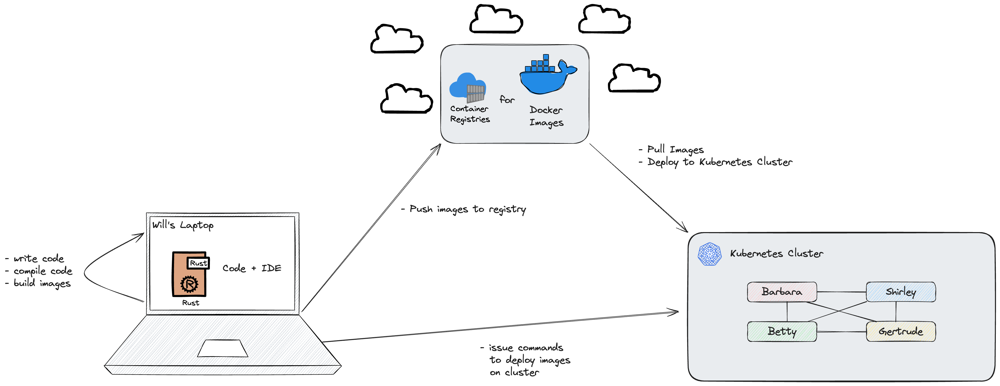

# Github Actions to Docker Registry

This example shows how to use [Github Actions](https://github.com/features/actions) to build and push a Docker image to a [Docker registry](https://hub.docker.com/).

## Why?

I'm trying to deploy an application onto a [Kubernetes](https://kubernetes.io/) cluster. The application consists of several different binaries / containers. Each of the services has a configuration that specifies where to pull the container image from.



## Docker Commands

### Build the image

```bash
docker build -t github-actions-to-docker-registry .
```

### Run the image

```bash
docker run --rm github-actions-to-docker-registry 
```

## FAQ

### What if I don't want to create a new image for every commit?

Some commits contain only changes to the documentation or the CI/CD pipeline. In this case, it is not necessary to create a new image.

Read https://github.com/PostgREST/postgrest/issues/2006